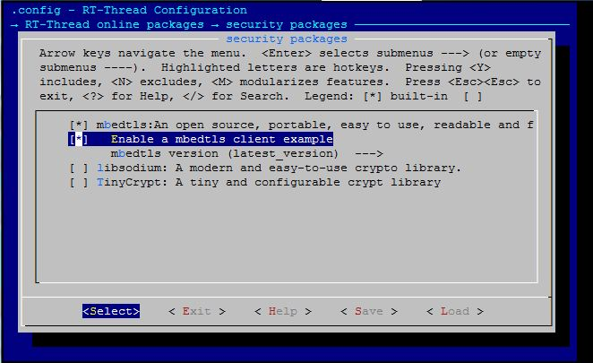

# mbedTLS

## 1、介绍 

mbedTLS（前称PolarSSL）是一个ARM公司授权的开源的SSL库，主要是用于嵌入式产品中的加密和SSL/TLS功能。    
这个 [mbedtls](https://github.com/RT-Thread-packages/mbedtls) 库是RT-thread针对[ARMmbed/mbedtls](https://github.com/ARMmbed/mbedtls/)库的移植， 有关mbedTLS的更多信息，请参阅[https://tls.mbed.org](https://tls.mbed.org) 。

## 2、获取方式   

-  Git方式获取：
`git clone https://github.com/RT-Thread-packages/mbedtls`

- env工具辅助下载：
  menuconfig package path：`RT-Thread online packages/security/mbedtls`

## 3、示例介绍

### 3.1 获取示例

menuconfig path：`RT-Thread online packages/security/mbedtls/Enable a client example`   
配置获取示例选项，配置包版本选为最新版`latest_version`，示例代码位置`examples/tls_app_test.c`

### 3.2 运行示例   
该示例为一个简单的TLS client，与外网建立TLS连接并传输数据。   
主要流程：client连接外网TLS测试网站`www.howsmyssl.com`-->client和server握手成功-->client发送请求-->server回应请求-->TLS测试成功。   
使用方式：msh cmd `tls_test`，finsh cmd `tls_test()`

    msh />tls_test   
    mbedtls client struct init success...   
    Loading the CA root certificate success...   
    mbedtls client context init success...   
    Connected www.howsmyssl.com:443 success...   
    Certificate verified success...   
    Writing HTTP request success...   
    Getting HTTP response...   
    （get response data）....   
    

## 4、常见问题

### 4.1 证书验证失败  

    [tls]verification info: ! The CRL is not correctly signed by the trusted CA

原因：mbedtls包中支持多种主流CA机构根证书，部分CA机构未支持   
解决方法：若测试其他TLS网站证书验证失败，手动获取测试网站根证书（Root Cerificate）添加到`mbedtls/tls_cerificate.c`文件中

### 4.2 证书时间错误：

    verification info: ! The certificate validity has expired
    verification info: ! The certificate validity starts in the future
    
原因：TLS握手是证书验证需要时间的验证，本地时间获取有误导致   
解决方式：检查RTC设备是否支持，检查`RT_USING_RTC`宏是否打开，校准设备时间

### 4.3 证书CN错误：

    verification info: ! The certificate Common Name (CN) does not match with the expected CN

原因：测试其他TLS网站时，若输入域名不符合证书的Common Name（CN）出现CN验证失败问题   
解决方法：检查输入域名和证书中CN是否匹配或输入IP地址

### 4.4 IAR编译错误

    Fatal Error "MBEDTLS_CONFIG_FILE" expected a file name 

原因：SConscript中预定义语法IAR编辑器不支持  
解决方法：拷贝`mbedtls-port/inc/tls_config.h`内容到`mbedtls/include/mbedtls/config.h`中

## 5、参考资料

- mbedTLS官方网站：https://tls.mbed.org/
- ARMmbed github：[mbedtls](https://github.com/ARMmbed/mbedtls/tree/72ea31b026e1fc61b01662474aa5125817b968bc)

