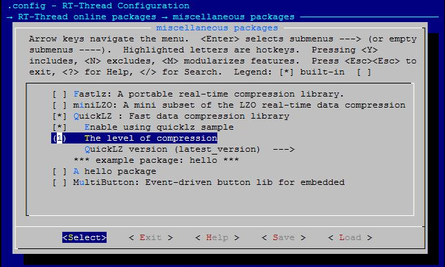

# QuickLZ

## 1、介绍

QuickLZ号称是世界上速度最快的压缩库，速度可达到单核308 Mbyte/s， 使用简单，易于集成。这个 [quicklz](https://github.com/RT-Thread-packages/quicklz) 库是RT-thread针对官方[qiuicklz](http://www.quicklz.com/download.html)的C库的移植， 有关quicklz的更多信息，请参阅[http://www.quicklz.com](http://www.quicklz.com) 。

## 2、获取方式

-  Git方式获取：
`git clone https://github.com/RT-Thread-packages/quicklz.git`

- env工具辅助下载：
  menuconfig package path：`RT-Thread online package` -> `miscellaneous package` -> `QucikLZ`

## 3、示例介绍

### 3.1 获取示例

- 配置使能示例选项 `Enable using quizklz sample`;
- 配置压缩等级选项，配置为level 1（有三种等级 1/2/3，level 1 压缩速度最快，压缩比最小，level 3 压缩速度最快，压缩比最大）;
- 配置包版本选为最新版 `latest_version` .

### 3.2 运行示例
该示例为一个简单的文件压缩和解压的例程，需要依赖文件系统，用到的命令有两个` -c`和 `-d`， `-c`命令压缩一个文件到另一个文件，`-d`命令解压一个文件到另一个文件。   
使用方式：msh cmd `qlz_test -c /file.bin /file.cmprs.bin` `qlz_test -d /file.cmprs.bin /file_dcmprs.bin`  

    msh />qlz_test -c /file.bin /file.cmprs.bin
    [qlz]compress start : >>>>>>>>>>>>>>>>>>>>>>>>>>>>>>>>>>>>>>>>>>>>>>>>>>>>>>>>>>>>>>>>>>>>>>>>
    [qlz]compressed 469848 bytes into 363495 bytes , compression ratio is 77%!
    msh />
    msh />qlz_test -d /file.cmprs.bin /file_dcmprs.bin
    [qlz]decompress start : >>>>>>>>>>>>>>>>>>>>>>>>>>>>>>>>>>>>>>>>>>>>>>>>>>>>>>>>>>>>>>>>>>>>>>>>
    [qlz]decompressed 363495 bytes into 469848 bytes !

## 4、常见问题

### 4.1 内存不足问题

   `[qlz] No memory for state_compress struct, need 36868 byte, or you can change QLZ_HASH_VALUES to 1024!`

原因：quicklz库压缩时所需的内存空间比较大，设备内存空间不足  
解决方法：修改`quicklz.h`文件中当前level等级下的`QLZ_HASH_VALUES`大小  

## 5、参考资料

- QuickLZ官方网站：http://www.quicklz.com  
- QuickLZ官方手册：[manual](http://www.quicklz.com/manual.html)  

